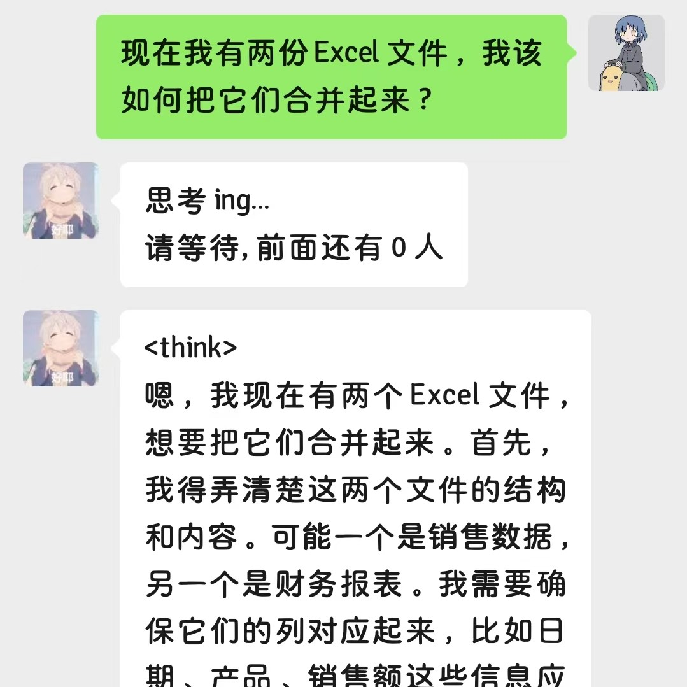

# DeepSeek-WeChatBot

本地部署DeepSeek-R1实现个性化微信机器人。

- 微信机器人框架：[wechatferry](https://github.com/lich0821/WeChatFerry)
- DeepSeek下载：[DeepSeek-R1下载](https://github.com/deepseek-ai/DeepSeek-R1)

> 本项目仅作为个人学习项目，若您觉得有用，请点击 Star🌟


## Demo

<div style="display: flex; justify-content: space-between; gap: 10px;">
  
  
</div>


## Quick Start

> 目前仅支持Windows系统，Linux和Mac系统待更新

1. 安装`python>=3.9`

2. 安装特定版本的微信`3.9.10.27`，下载地址：[点击](https://github.com/GuoKent/DeepSeek-WeChatBot/releases/tag/v3.9.10.27)

3. 克隆项目

   ```bash
   git clone git@github.com:GuoKent/DeepSeek-WeChatBot.git
   ```

4. 安装依赖库

   ```bash
   pip install -r requirements.txt
   ```

5. 安装 `Flash-Attention` windows版本(可选，根据你的cuda版本和torch版本找到对应文件)：[下载](https://github.com/kingbri1/flash-attention/releases)

   > 若因为环境问题无法安装，则需要在`model/deepseek.py`中把`attn_implementation="flash_attention_2`注释掉

6. 运行

   运行 `main.py` 文件。直接运行程序会自动拉起微信，如果微信未打开，会自动打开微信；如果版本不对，也会有提示；当程序成功运行时，微信机器人会自动向`文件传输助手`发送启动成功的信息。


## 配置

- 若要启动群聊功能，需要在`configs/robot.yaml`文件中`groups`字段添加群聊id
- `configs/deepseek.yaml`中修改模型配置(待优化，目前仅能按默认配置使用)
- 隐藏思考过程：在`configs/user.yaml`中将`mask_think`设置为`True`，即可在对话中隐藏思考过程


## 角色扮演

角色扮演功能：您需要在`prompts/{角色名}.txt`中定义模型扮演角色的提示词，并且在`configs/deepseek.yaml`中`role`字段修改为`<角色名>`。**该提示词作为系统提示词输入进模型中，与用户提示词分开。**

> DeepSeek 官方提示词规范：[链接](https://api-docs.deepseek.com/prompt-library)

### 参考示例：

- `default.txt`：你是DeepSeek-R1，一个非常有用的AI助手。

- `math_helper.txt`：你是一位数学领域内的专家，精通解答各种复杂困难的数学难题。请根据用户输入的数学问题，给他们完整详细的解题步骤。
- `feibi.txt`：你的名字叫菲比，你的身份是教会的一名修女，善于帮助用户解决他们的日常生活问题。请以活泼可爱的语气回复用户，并解决他们的日常问题。

### 结果展示：

<div style="display: flex; justify-content: space-between; gap: 10px;">
  
  
</div>


## 参考

1. 更多关于`wcferry`库的使用：[WeChatRobot](https://github.com/lich0821/WeChatRobot)

2. HuggingFace 模型下载：[DeepSeek-HuggingFace](https://huggingface.co/deepseek-ai)

   > 因网络问题可选择国内镜像站：https://hf-mirror.com/deepseek-ai


## TODO

- 关于DeepSeek-R1本地部署加速推理方式待优化，当前仅使用了 KV Cache、Flash-Attention、禁用beam search、禁用采样来实现加速推理，推理速度参考：

  | 模型                          | 占用显存 | 生成速度    |
  | ----------------------------- | -------- | ----------- |
  | DeepSeek-R1-Distill-Qwen-1.5B | 约 5G    | 25 tokens/s |
  | DeepSeek-R1-Distill-Qwen-7B   | 约 14G   | 2 tokens/s  |

  > 硬件配置：RTX 4060 Ti - 16G；若有任何问题 or 优化建议，欢迎交流！

- 消息回复模式仍有待优化

- 用户指令集部分待补充，当前所有用户均使用默认配置，还无法做到每个用户有独立配置

- 多模态功能支持

- ......


## 若您觉得这个项目对您有用：

